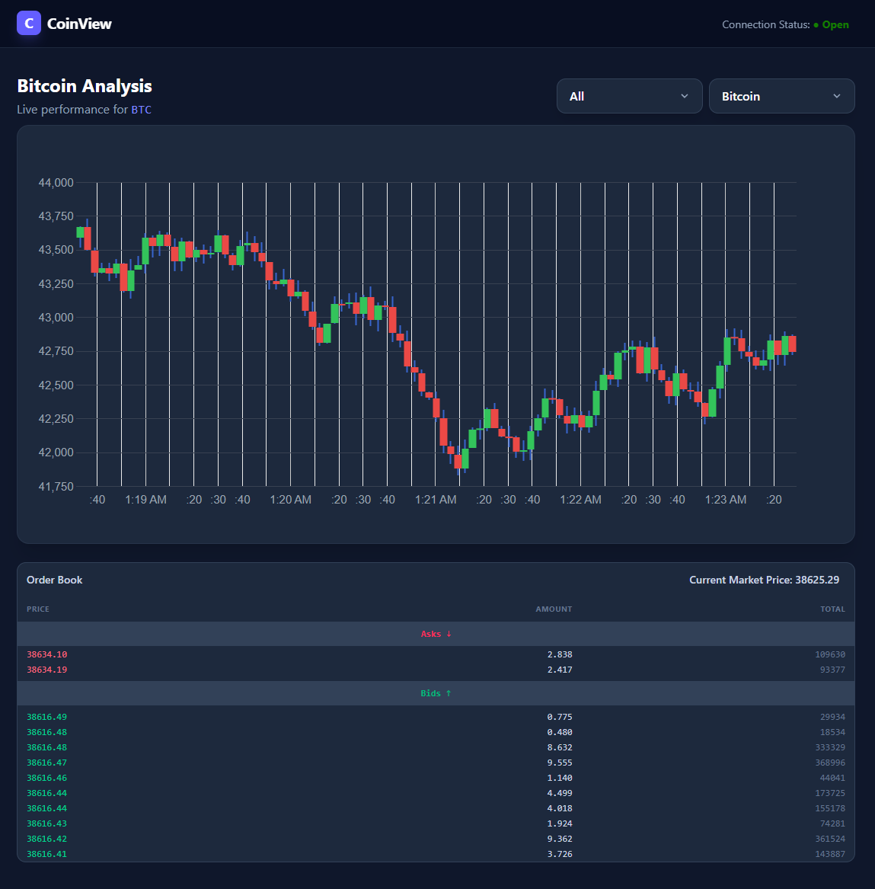

# Fe-Candle

A small React + TypeScript single-page application for visualizing live crypto market data. It displays candlestick charts and an order book for selected trading pairs, fetching initial data over HTTP and subscribing to a WebSocket server for live updates. This project is a frontend task/demo intended to show real-time market data visualization with simple, testable components.

## Quick summary
- Purpose: Demo frontend to visualize live candlestick charts and order book data for crypto pairs.
- Primary features:
  - Candlestick chart (Google Charts)
  - Order book view (asks and bids)
  - WebSocket subscription for live updates
  - Lightweight, testable components with Tailwind CSS styling

## Screenshot



## Technologies & Tooling
- Framework: React (v19)
- Language: TypeScript
- Bundler / Dev server: Vite
- Styling: Tailwind CSS
- Charts: `react-google-charts` (CandlestickChart)
- WebSocket client: `react-use-websocket`
- State Management: `mobx` / `mobx-react`
- Testing: Vitest + Testing Library (`vitest`, `@testing-library/react`, `@testing-library/jest-dom`)
- Dev tooling: `@vitejs/plugin-react`, `typescript`, `jsdom`, `biome` available in devDependencies

## Project structure (key files)
- `src/App.tsx` — Main app: fetches initial data, manages selected pair/stream, subscribes to WebSocket and routes incoming messages to formatters/state.
- `src/components/CandleChart/CandleChart.tsx` — Candlestick chart wrapper using `react-google-charts`. Shows spinner while loading.
- `src/components/OrderBook/OrderBook.tsx` — Order book UI (asks/bids), calculates & displays current market price, shows spinner while loading.
- `src/constants/constants.ts` — Chart options and coin metadata.
- `src/constants/types.ts` — Shared TypeScript types for candles and order book items.
- `src/utils/endpoints.ts` — `getCandles` and `getOrderBook` initial HTTP fetchers.
- `src/utils/formatters.ts` — `ArrAPItoChartData` and `AppendItemToChartData` converters for chart input.
- `vite.config.ts`, `tsconfig*.json`, `package.json` — Build and tooling configuration.

## Per-component details and packages used

- `src/App.tsx`
  - Uses: React hooks (`useState`, `useEffect`), `react-use-websocket`.
  - Responsibilities:
    - Fetch initial candles and orderbook via `getCandles` / `getOrderBook`.
    - Transform candle API responses using `ArrAPItoChartData`.
    - Subscribe to WebSocket via `sendJsonMessage({ type: "subscribe", pair, stream })`.
    - Update local state on incoming `lastJsonMessage` values.

- `src/components/CandleChart/CandleChart.tsx`
  - Uses: `react-google-charts`'s `Chart` component.
  - Responsibilities:
    - Render `CandlestickChart` with `CHART_OPTIONS`.
    - Display a centered spinner when `loading` prop is `true`.
  - Test strategy:
    - Mock `react-google-charts` to a lightweight stub in unit tests.

- `src/components/OrderBook/OrderBook.tsx`
  - Uses: Plain React + Tailwind CSS. No external component library required.
  - Responsibilities:
    - Render lists of asks and bids.
    - Compute `bestPrice` as the average of top ask and top bid: `((asks[0]?.price || 0) + (bids[0]?.price || 0)) / 2`.
    - Display spinner when `loading` prop is `true`.
  - Edge cases:
    - Empty asks / bids are handled using optional chaining and defaults.

- `src/utils/endpoints.ts`
  - Exports expected: `getCandles(pair)` and `getOrderBook(pair)`.
  - Responsibilities: fetch initial data shapes used by formatters and components.

- `src/utils/formatters.ts`
  - Exports: `ArrAPItoChartData` and `AppendItemToChartData`.
  - Responsibilities: adapt API candle arrays to the `react-google-charts` 2D array format (header row + numeric rows) and append updates.

## WebSocket integration
- Hook: `react-use-websocket`
- URL used in source: `ws://localhost:3001`
- Flow:
  - On mount and when `selectedCoin` / `selectedData` change, `App` sends a subscribe message.
  - Incoming messages appear in `lastJsonMessage`. `App` handles `type === 'candle_update' | 'initial_candles'` and orderbook-related message types, updating state appropriately.

## Scripts
- Install dependencies and run project:
```powershell
npm install
npm run dev